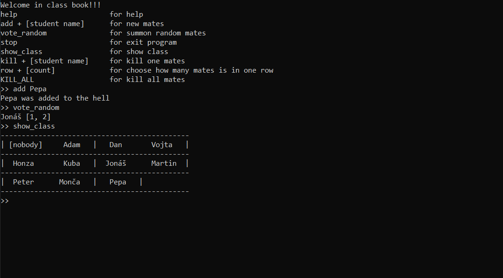

# Class

Program represents class Book
The program seves students and load them when you start program again

## Commands

- help                      for help
- add + [student name]      for new mates
- vote_random               for summon random mates
- stop                      for exit program
- show_class                for show class
- kill + [student name]     for kill one mates
- row + [count]             for choose how many mates is in  - one row
- KILL_ALL                  for kill all mates

 
