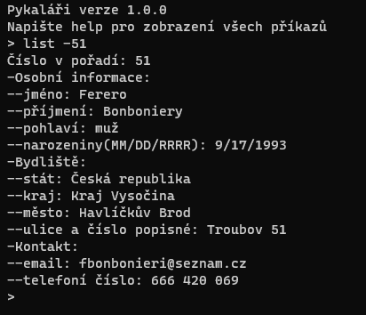
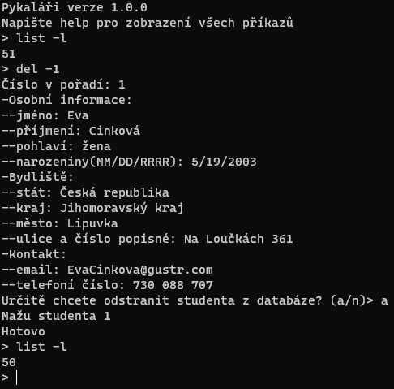
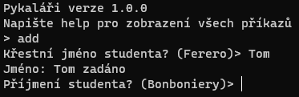

[//]: # (Made by ostSTRUPpen)

# Pykaláři  
  
## Informace  
* Za použití příkazového řádku a jedno .txt souboru vám přinášíme podobný uživatelský zážitek, jako systém Bakaláři  
* Narozdíl od Bakalářů naše profesionální databáze funguje a nemusíte se bát nestability  
* a další marketig parodující blbosti  
## Skutečné informace  
* Pomocí .txt souboru spousty | a \n se změny provedené v příkazech uloží  
* Lze:  
  * zobrazovat celou třídu nebo jednotlivé studenty  
      
  * odstraňovat studenty  
    
  * přidávat studenty (nedoporučuji)  
    
    
## Potřeby  
* Všechny stáhnutelné soubory, kromě others  
* Python  
## Specialita  
* Pro naplnění databáze daty jsem využil stránku [fakenamegenerator](https://www.fakenamegenerator.com/ 'Stránka ze které jsou všechna data')  
  * Readme od [fakenamegenerator](.others\fake_names_generator_readme.txt)

  